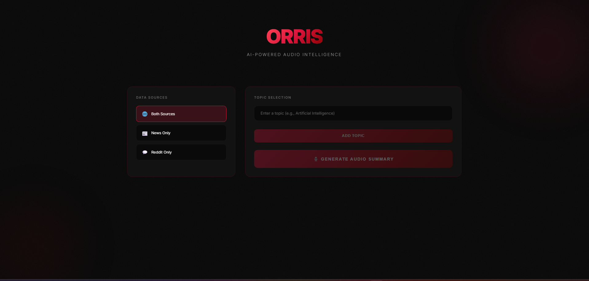

# Demo

https://github.com/user-attachments/assets/7cac997c-df26-4b17-b330-ff92bdac4a92


## Features  

### 🎯 Core Functionality  
- 🌐 **Topic-Based Search** – Enter any topic of your choice and fetch relevant content.  
- 📰 **News Scraping** – Automatically gather news articles using BrightData.  
- 💬 **Reddit Insights** – Fetch Reddit posts and user reviews related to your query.  
- 🤖 **AI Content Processing** – Intelligent summarization and filtering of the scraped content.  
- ⚡ **Real-time Results** – See search results and summaries instantly.


## 🛠️ Tech Stack  

- [BrightData MCP](https://brightdata.com/) – Scrapes news and Reddit content efficiently.  
- [ElevenLabs](https://elevenlabs.io/) – Optional voice generation.  
- [Langraph](https://www.langchain.com/langgraph) – Multi-agent orchestration. 
- HTML, CSS, JS - Modern web UI.


## ⚙️ Environment Variables  

Create a `.env` file in your project root with the following keys:  

```bash
ELEVENLABS_API_KEY=your_elevenlabs_key_here
BRIGHTDATA_API_TOKEN=your_key
WEB_UNLOCKER_ZONE=orris
HF_API_KEY=your_huggingface_key_here
```

# UI Preview

